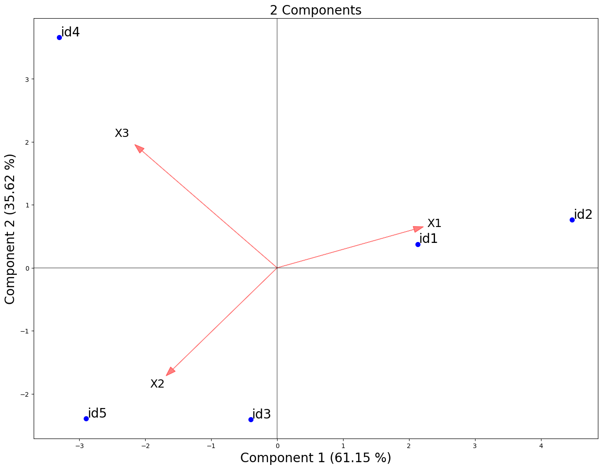
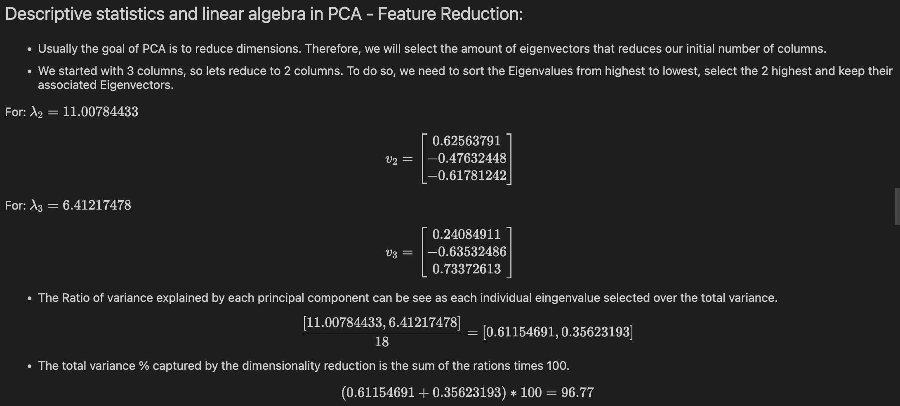
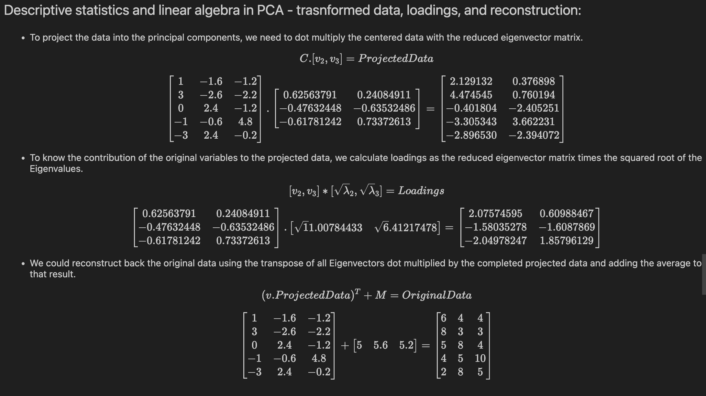

# PCA Biplot in Python: Principal Component Analysis Visual

---

## Goal

Example of use for PyBiPlot package and explanation of PCA.



## Overview of PCA

- Is an unsupervised learning method used only for continuous variables.
- Assumes that variables are somewhat correlated.
- Does not involve Hyperparameters.
- Highly affected by outliers.
- Is a nonparametric method.

---

## Steps for the Algorithm

**Step 1: Center the data**
- Centering or standardizing data

**Step 2: Covariance Matrix**
- Get covariance and variance for variables

**Step 3: Eigenvectors & Eigenvalues**
- Eigendecomposition for covariance matrix

**Step 4: Feature Reduction**
- Keep desired, or all, eigenvectors of principal components

**Step 5: Recast along principal components axes**
- Reorient or project the data from original axes along the principal components

---
## PCA math:




### Code used:

```python
plotter = BiPlot(ProjectedData = pca_df ,
                 Loadings = loading_df ,
                 ExplainedVar = list(pca.explained_variance_ratio_), 
                 Overlaid = True,
                 Sample_size=50,
                 Sample_labels_size=20,
                 Arrow_head_size=0.1,
                 Arrow_labels_size=18,
                 X_label_size = 20,
                 Y_label_size = 20).plot()
```